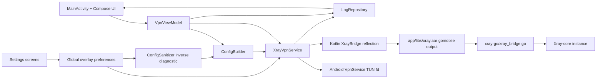

# Architecture & Security Reference

This document covers the technical architecture, fail-closed security guarantees, and structural details of the XTLS Core Proxy codebase.

## Repository Structure

Single-module Gradle build (`:app`) + a separate Go module (`xray-go/`) wrapped via `gomobile bind` into `app/libs/xray.aar`.

**Per-feature maintainer docs live under `docs/features/` — check there before grepping.**

```
.
├── .github/workflows/build.yml     CI — AAR build + assembleDebug + unit tests + lintDebug
├── app/
│   ├── build.gradle.kts            App module build config
│   ├── proguard-rules.pro
│   ├── libs/xray.aar              Generated by scripts/build-xray-aar.* (gitignored)
│   └── src/
│       ├── main/
│       │   ├── AndroidManifest.xml
│       │   ├── assets/            Tracked: WHERE_TO_GET_GEOFILES.md, boykisser-assetlinks.json; geoip*/geosite* .dat gitignored
│       │   ├── java/com/justme/xtls_core_proxy/
│       │   │   ├── MainActivity.kt, ProfileActionsDialog.kt, XtlsApplication.kt
│       │   │   ├── add/           Paste/clipboard/subscription routing → Add UI
│       │   │   ├── apps/          Installed-app picker (kill-switch/split-tunnel)
│       │   │   ├── bridge/        XrayBridge — reflection facade over xray.aar
│       │   │   ├── config/        ConfigBuilder (mandatory normalization + overlays), ConfigSanitizer, codecs → docs/features/
│       │   │   ├── db/            Room: AppDatabase, Profile/Subscription DAOs
│       │   │   ├── failover/      Health probe, rotation engine, pool resolver, fastest-connect → docs/features/auto-failover.md
│       │   │   ├── geo/           GeoAssetPreparer (.dat files → app private dir)
│       │   │   ├── i18n/          LocalizedComponentActivity, SupportedLanguage
│       │   │   ├── killswitch/    Kill-on-foreground → docs/features/
│       │   │   ├── log/           LogRepository (state/log surface + BLACKHOLED), VpnConnectionLabels, LogsActivity → docs/features/
│       │   │   ├── nametheft/     Name-theft warning, remote-gated "time bomb" → docs/features/
│       │   │   ├── privacy/       Device identity (HWID), headers, HwidSettingsActivity → docs/features/hwid-device-identity.md
│       │   │   ├── settings/      Per-server + settings hub screens (Fragmentation/Mux/DNS/Routing/XRAY/Config Sanitization/Ping) → docs/features/
│       │   │   ├── sideload/      Sideloading warning (launch trigger dormant) → docs/features/
│       │   │   ├── split/         Split-tunnel + SplitTunnelPlanner → docs/features/
│       │   │   ├── state/         VpnViewModel, ConnectAction/ReconnectFlow, PingCoordinator, AutoPingLatch → docs/features/
│       │   │   ├── subs/          Subscription fetch/parse/refresh, PromoGate, Boykisser* activities
│       │   │   ├── tile/          QS Tile + TileClickDecision → docs/features/
│       │   │   ├── ui/            Reusable Compose components + theme → docs/features/app-appearance.md
│       │   │   └── vpn/           XrayVpnService, StartCommandDecision, SessionLifecycleDecision, VpnNotifications → docs/features/
│       │   └── res/
│       │       ├── drawable/, mipmap-*/  (ic_speedometer.xml, ic_bolt.xml)
│       │       ├── values/        strings.xml (source of truth), colors, themes
│       │       ├── values-ru/     Russian strings.xml
│       │       └── xml/           backup_rules, data_extraction_rules, locales_config, network_security_config (LOAD-BEARING cleartext exemption)
│       ├── androidTest/java/...   Instrumented tests
│       └── test/java/...          JVM unit tests
├── docs/
│   ├── features/                  Per-feature maintainer reference — CHECK HERE FIRST
│   ├── play-policy-declarations.md
│   ├── qa/                        QA scenarios (incl. auto-failover-qa.md)
│   └── superpowers/               Working artifacts (plans/specs); specs not committed
├── gradle/, scripts/, xray-go/    (see main AGENTS.md)
├── build.gradle.kts, settings.gradle.kts, gradle.properties
├── AGENTS.md, CLAUDE.md, README.md, LICENSE
└── .gradle/, .kotlin/, .idea/     (generated/IDE state, gitignored)
```

**Known `docs/features/` gaps**: promo gating (`subs/PromoGate`), subscription management, `add/` routing, per-server editor, `db/` Room layer, `geo/GeoAssetPreparer`, split-tunnel doc, `vpn/VpnNotifications`.

## Architecture & Fail-Closed Security

The architecture and security model are inseparable — both implement leak-proofing guarantees that reason together.

### Data Flow



The UI collects user input (a `vless://`, `hysteria2://`/`hy2://` share link, or raw Xray JSON), then `VpnViewModel` converts it into runtime JSON via `ConfigBuilder` and starts `XrayVpnService`. The service creates a TUN interface, passes its fd into `XrayBridge`, and starts/stops Xray-core through the Go mobile bridge. Connection state and sanitized logs flow through `LogRepository` back to the UI.

### Settings Capture Model

Three independent settings rails with different lifetimes:

1. **Session-captured (TuningSettings)**: Global overlays (DNS, Mux, Routing, XRAY, Fragmentation) are captured once per full connection. `XrayVpnService` snapshots these on connect and reuses the immutable `TuningSettings` for kill-switch revives. Settings screens **autosave** on change, but changes apply only to the next full connection.

2. **Per-probe (PingPreferences)**: `VpnViewModel` loads `PingPreferences` fresh when accepting each probe. `PingCoordinator` is stable (a `val`, never swapped) with cross-run `inFlight` de-dup and fixed native-slot ceiling; per-run concurrency is passed into `runGroup`. Auto-ping probes the atomic flat `profiles` query (`VpnViewModel.autoPingProfiles`, **not** the subscription-grouped view which raced loads) once per app launch via process-scoped `AutoPingLatch`. See `docs/features/ping-test.md`.

3. **Live-observed (FailoverPreferences)**: `XrayVpnService` **seeds** `FailoverPreferences.load(...)` on connect (load-bearing: the process-global StateFlow starts at `DEFAULT`) then observes `FailoverPreferences.state` for the session. While `CONNECTED`, `TunnelHealthMonitor` probes the **live tunnel** and rotates after N consecutive failures. See `docs/features/auto-failover.md`.

### ConfigBuilder: The Mandatory Normalization Chokepoint

`ConfigBuilder.buildRuntimeConfig(input, log, tuning)` is the single point that enforces:

1. **Tun-only inbound**: Sanitizes any config's inbounds into the canonical `tun` inbound (no longer rejects `socks`/`http` — rewrites them).

2. **Secure-DNS enforcement**: DoH-only resolver, all port-53 → `dns-out`, `ForceIP` server-name bootstrap. See `docs/features/dns-leak-enforcement.md`.

3. **Forced log object**: Overwrites (not merges) the config's log with app-private path, preventing redirect of Xray's writes. See `docs/features/logs-screen.md`.

4. **Overlay pipeline order** (load-bearing):
   ```
   forceLog → applyFragmentation → applyMux → applyDns → applyRouting → applyCoreSettings
   ```
   - DNS must precede routing so `BLOCKED_ONLY` DoH guard sees effective resolver
   - Core settings run last so IPv6-off and forced sniffing win

For pasted JSON configs, the secure base first runs `replaceJsonInboundsWithTun` (ordered pair: `sanitizeProxyBalancers` then `reconcileInboundTagRules`).

### Three Fail-Closed Runtime Backstops

Global settings compose after mandatory normalizations. Three backstops sit on the same runtime chokepoint:

1. **Routing's `effectiveRoutingMode`**: Degrades unsupported `BLOCKED_ONLY` country to proxy-all before direct catch-all can be emitted.

2. **XRAY IPv6-off**: Keeps IPv6 captured by Android VPN, inserts in-tunnel `::/0 → block` rule, forces `queryStrategy=UseIPv4`.

3. **DNS IPv6-off**: Degrades v6-only **custom** DoH resolver to Cloudflare v4 preset (all four presets are IPv4), keeping DNS encrypted and unstranded. See `docs/features/dns.md`, `docs/features/xray-settings.md`.

### Loop-Avoidance: Socket-Level Protection

**Loop-avoidance is socket-level, not app-exclusion.** The Go bridge installs one global Xray dial controller that calls back into a reverse-bound `Protector`, pulling Xray's own sockets out of the tun via `VpnService.protect()`. The **whole app** is tunneled — no app traffic leaks around the tun. `onStartCommand` is a total `StartCommandDecision` returning `START_REDELIVER_INTENT` for crash/always-on recovery. See `docs/features/failclosed-startup.md`.

**Why this matters for auto-failover**: Whole-app tunneling is what makes the health probe valid — reverting to app-exclusion would silently turn the watchdog into a clear-network measurement that never fires.

### Health Probe Routing Validity

The health probe has two independent dependencies:

1. **Whole-app tunneling** (above): Probe must reach the tun
2. **Routing carve-out**: Probe must route to proxy once inside tun

`ConfigBuilder.applyRouting` emits **two** carve-out rules in **every** mode:
- `domain: full:<HEALTH_PROBE_HOST> → proxy`
- `ip: <HEALTH_PROBE_IPS> → proxy`

(Structural twin of `BLOCKED_ONLY` DoH guard, placed beside it, ahead of LAN/ads and ahead of pasted config's preserved rules)

When imported config routes via `balancerTag`, both rules name that balancer so watchdog measures the same path user traffic takes. Three things would otherwise claim the probe: `BLOCKED_ONLY`'s direct catch-all, `EXCEPT_COUNTRY`'s country directs (`geoip:ru` can match Cloudflare anycast), and direct rules in pasted configs (preserved in all modes).

**Why the probe target is fixed**: `ConfigBuilder.HEALTH_PROBE_TARGET_URL` is immutable because a static routing rule cannot track an editable value (the user-editable Ping Test target is separate).

**Why two rules**: The `domain` rule needs sniffing (not forced under `PROXY_ALL` + ads off + sniffing toggle off); the `ip` rule matches `Outbound.Target` and covers default posture with no sniffing. They're alternatives — if addresses go stale, `ip` rule stops matching and behaviour degrades to `domain`-only instead of breaking. Residual risk: address change **and** sniffing off (fix: refresh `HEALTH_PROBE_IPS`; forcing sniffing would activate pasted config's `domain` rules and leak real traffic).

**InboundTag reconciliation** (`replaceJsonInboundsWithTun`): toward-proxy `inboundTag` rules rewritten onto `tun-in`; direct/block inboundTag rules dropped (never rewritten — would move traffic away from proxy).

### Balancer Validation & Deletion

`ConfigBuilder.sanitizeProxyBalancers` runs first inside `replaceJsonInboundsWithTun` (third mandatory normalization on same chokepoint). Xray `selector` entries are **prefixes** (`outbound.Manager.Select` → `strings.HasPrefix`), not exact tags:

- Each selector expanded against real non-helper proxy outbounds, rewritten as exact members
- `fallbackTag` naming helper (freedom/blackhole/dns) or unknown outbound is stripped
- Balancer left with no proxy member is **left exactly as user wrote it**

Without fallback strip, a balancer whose live members are all dead falls back to `direct` → health probe succeeds on clear network with proxy down → false healthy (the one answer watchdog must never get).

**Do not "clean up" non-proxy balancers by deleting them.** `Router.Init` in xray-core resolves every `balancerTag` while building router; unknown balancer stops core from starting (profile becomes unconnectable behind opaque error). InboundTag reconciliation doesn't cover it — only inspects rules whose `inboundTag` died in tun rewrite. Archetype: `geosite:` country rule pointing at balanced direct egress (carries no `inboundTag`). Deleting rules would silently reroute user's deliberate-direct traffic onto proxy (real cost on metered link). Carrying balancer through is safe: `safeBalancerTags` admits only balancers whose selector names proxy outbound exactly.

### Imported Config Routing Precedence

**The imported config's routing WINS over routing-mode setting, by decision.** Preserved config rules emitted ahead of nothing that would override them; Xray is first-match → imported "this country goes direct" rule keeps working under `PROXY_ALL`.

**Do not "fix" this**: It's the user's app and config. Forcing mode over it would silently push metered/geo-restricted traffic onto tunnel — a cost decision that's theirs. Settings-override knob is planned **opt-in** follow-up.

Three things stay outside that knob (correctness, not policy):
- Mandatory secure-DNS chokepoint
- Health-probe carve-out (one hostname, or watchdog measures clear network)
- LAN bypass (settings win)

See `docs/features/routing-rules.md`.

### Auto-Failover: Fourth Fail-Closed Guarantee (Runtime Layer)

When no server can be brought up, service re-establishes a **blackhole TUN** — same routes/addresses/DNS/split-tunnel plan as real bring-up, but no protector and no Xray. Packets enter an fd nobody reads and are dropped.

**Why not "just keep dead tunnel up"**: All-servers-dead path tears TUN down **before** final bring-up fails, so exposure would depend on where bring-up died.

**Three outcomes** (`CONTAINED_BY_LIVE_TUNNEL` / `CONTAINED_BY_BLACKHOLE` / `UNPROTECTED`) must never share one user-facing message; uncontained one must never inherit containment copy.

**Rotation bridge**: Each rotation tears tunnel down under `lock` then builds next config off-lock for seconds. `rotateTunnel` opens **rotation bridge** over that window; `bringUpTunnel` releases it immediately before `establish()` — release-then-establish, adjacent, no I/O between. It lives in own field (`rotationBridgeInterface`), **never** in `tunInterface` (which means "live, still-proxying tunnel"). Bridge stored in `tunInterface` would make give-up landing in gap report `CONTAINED_BY_LIVE_TUNNEL`. Give-up **adopts** bridge instead of building second TUN. Every other exit from gap must release bridge — leaked bridge is leaked VPN interface.

**BLACKHOLED is a live, stoppable state**: Every surface treating running session as stoppable must include it (tile Stop gate ×2, tile render, `MainActivity.isActive`, in-app Disconnect gate).

**Connect gate is separate** and no longer boolean: `state/connectAction` maps `BLACKHOLED` → `RECONNECT` (not "not connectable"). `state/ReconnectFlow` serves as sequenced stop-then-start (plain connect would hit "VPN already running"). Widening enum needs **grep sweep**, not green build — read by plain boolean chains compiler cannot flag. Two JVM whole-enum guards automate most sweep: `TileClickDecisionTest` and `MainActivityStateTest`.

See `docs/features/auto-failover.md`.

### Health Probe Cleartext Exemption (Load-Bearing)

`TunnelHealthMonitor` uses plain-Kotlin **cleartext** HTTP 204 through live tun. Only legal because `res/xml/network_security_config.xml` carves out `HEALTH_PROBE_HOST` and `<application>` wires it via `android:networkSecurityConfig`.

**This chain is load-bearing**: `HttpURLConnection` governed by `NetworkSecurityPolicy`; at `targetSdk = 36` cleartext denied by default. Breaking any link (rename host, delete file, drop attribute) fails **every** probe → watchdog answers with rotation storm over healthy servers. `HealthProbeSchemeTest` couples all three.

**Why cleartext over HTTPS**: With no tunnel, probe is on clear network where plaintext `/generate_204` is indistinguishable from Android's own captive-portal check; TLS handshake is not. Ping Test target also `http://` but for unrelated reason (Go bridge dials over raw native sockets) and needs no exemption.

## Dormant / Temporarily-Disabled Features

Feature **entry points** intentionally switched off. Disabling is **at call sites only** (commented-out manifest filters / `false` flag) — every definition kept in place, some as dead code. Do **not** "clean up" unused-symbol/unused-resource warnings by deleting dead code. Do **not** re-enable without maintainer approval.

### Promoted "Boykisser VPN" Subscription

**Deep links dormant; in-app promo LIVE but remote-gated.**

Only manifest entry points switched off: in `AndroidManifest.xml` the two `subs/BoykisserLinkActivity` `<intent-filter>`s commented out → `bkvpn://add` **deep link** and `https://boykiss3r.site/app/add` **App Link** no longer resolve (`BoykisserLinkActivity` stays `android:exported="true"` but with no intent-filters nothing launches it implicitly).

Everything else active in code:
- Home banner (`MainActivity`) and Subscriptions promo row (`subs/SubscriptionsActivity`) both render when `PromoGate.resolve(...) == true && !PromotedSubscription.hasValidSubscription(...)` — **not** hard-coded `showPromo = false`
- `subs/PromoGate` is remote kill-switch (deliberate behavioral clone of name-theft gate — duplication intentional, do not extract shared helper): probes `/dowepromote` on `boykiss3r.site` then `somenewsteps.space` (HTTP 418 = show now, 409 = disarm, 451 = re-arm), persists disarm lease via `subs/PromoGateRepository` (`xray_prefs` / `promote_disarmed`), on inconclusive probe falls back to device-local date gate (shows on/after 2026-08-01)
- Nag screen (`subs/BoykisserInfoActivity`) reachable from banner and promo row; inbound add path live: paste-and-submit hands approved URL to `MainActivity.maybeAddBoykisserSub(...)`, called (not commented out) from `onCreate`/`onNewIntent`, re-validates approved-domain allowlist (extra is forgeable)

`docs/features/boykisser-vpn.md` / `boykisser-nag-screen.md` pre-date PromoGate re-enable — trust this section over them until refreshed.

### Sideload "Keep Android Open" Launch Popup

**Disabled.** Gated behind `MainActivity.SIDELOAD_WARNING_LAUNCH_ENABLED = false`. Dialog, `SideloadWarningRepository`, strings, on-demand Settings-hub entry all remain. Flip flag to restore once-per-version launch prompt. See `docs/features/sideloading-warning.md`.

**Note**: `boykiss3r.site` / `somenewsteps.space` **live** for two active probe paths — name-theft warning's status probe (`nametheft/NameTheftWarning.kt`) and promo gate's `/dowepromote` probe (`subs/PromoGate.kt`). Only promo **add** deep-link routes on those domains are dormant.

## Security Notes

- Never commit secrets or personal endpoints; treat pasted `vless://` links, UUIDs, REALITY keys as sensitive
- `LogRepository` redacts UUID/publicKey/shortId patterns before displaying logs
- `ConfigSanitizer` is diagnostic-only: builds through real runtime pipeline, reports effective policy (not full JSON), conservatively redacts, has no profile/settings write or reconnect path
- Xray-core writes **raw, unredacted** error log to app-private `filesDir/logs/xray-core.log` during connection. Copy/Share/Export in Logs screen read only redacted in-memory `LogRepository` buffer — never that file. Do not add code path that reads/shares file directly. See `docs/features/logs-screen.md`
- Subscription fetches send Happ-parity `x-hwid` + device headers built by `DeviceIdentityHeaders` (sanitizes CR/LF + control chars to prevent header injection); HWID is minted random 16-hex, never real Android ID. See `docs/features/hwid-device-identity.md`
- `.gitignore` excludes local/dev artifacts (`local.properties`, generated `app/libs/*.aar`, geo data assets, `xray-go/go.sum`)
