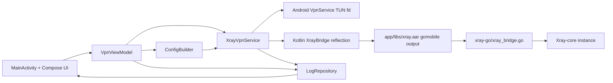

# Project Overview
XTLS Core Proxy is an Android 13+ MVP VPN client that runs Xray-core in tun-only mode without
`tun2socks`, using an Android `VpnService` TUN interface passed into Xray through a gomobile-built
Go bridge (`app/libs/xray.aar`). The app accepts either `vless://` URIs or raw Xray JSON, normalizes
runtime config to a single `tun` inbound, and manages tunnel lifecycle from a Jetpack Compose UI.

## Repository Structure
- `.idea/` - Android Studio project metadata; treat as IDE-local unless a maintainer asks for edits.
- `app/` - Android app module (Compose UI, VPN service, runtime config builder, unit/instrumented tests).
- `gradle/` - Gradle wrapper and version catalog configuration.
- `scripts/` - Build helpers for generating `app/libs/xray.aar` with `gomobile bind`.
- `xray-go/` - Go bridge package that starts/stops one Xray-core instance and exports mobile bindings.
- Root build files (`build.gradle.kts`, `settings.gradle.kts`, `gradle.properties`, `gradlew*`) define
  project-wide Gradle behavior and tasks.

## Build & Development Commands
1. Install Go mobile prerequisites (from repo `README.md`).

```powershell
go install golang.org/x/mobile/cmd/gomobile@latest
gomobile init
```

2. Build the Xray AAR (Windows PowerShell).

```powershell
./scripts/build-xray-aar.ps1
```

3. Build the Xray AAR (Linux/macOS Bash).

```bash
./scripts/build-xray-aar.bash
```

4. Build Android debug APK (from repo `README.md`).

```powershell
./gradlew.bat :app:assembleDebug
```

5. Install and run debug build on a connected device.

```powershell
./gradlew.bat :app:installDebug
```

6. Run tests (unit + device/instrumentation).

```powershell
./gradlew.bat :app:testDebugUnitTest
./gradlew.bat :app:connectedDebugAndroidTest
```

7. Lint and full verification checks.

```powershell
./gradlew.bat :app:lintDebug
./gradlew.bat :app:check
```

8. Type-check/compile Kotlin without packaging.

```powershell
./gradlew.bat :app:compileDebugKotlin
```

9. Debug support (runtime logs).

```powershell
adb logcat
```

> TODO: Agree on log filters/tags for repeatable debugging commands.

10. Release build and deploy handoff.

```powershell
./gradlew.bat :app:bundleRelease
```

> TODO: Document the final deployment path (Play Console/internal distribution) and credentials flow.

## Code Style & Conventions
- Kotlin style is `official` (`gradle.properties`), with 4-space indentation and standard Kotlin/AGP
  defaults.
- Naming: `PascalCase` for classes/objects/composables, `camelCase` for methods/properties, and
  `UPPER_SNAKE_CASE` for constants.
- Package names stay lowercase (for example, `com.justme.xtls_core_proxy.*`).
- Keep VPN/runtime code explicit about failure states; surface user-visible errors through
  `LogRepository`/`VpnViewModel`.
- Linting uses Android Gradle lint tasks (`:app:lint*`); no dedicated `ktlint`/`detekt` config exists.
- Commit messages currently have no enforced lint rule; use this template for consistency:

```text
<Short imperative summary>

Why:
- <reason 1>
- <reason 2>
```

## Architecture Notes


The UI collects user input (VLESS URI or JSON), then `VpnViewModel` converts it into runtime JSON via
`ConfigBuilder` and starts `XrayVpnService`. The service creates a TUN interface, passes its fd into
`XrayBridge`, and starts/stops Xray-core through the Go mobile bridge. Connection state and sanitized
logs flow through `LogRepository` back to the UI.

## Testing Strategy
- Unit tests: JUnit4 tests under `app/src/test` (for example, `ConfigBuilderTest`) validate runtime
  config generation and input rejection logic.
- Integration/device tests: Android instrumented tests under `app/src/androidTest` run with
  `AndroidJUnit4` on connected hardware/emulator.
- Local test commands:

```powershell
./gradlew.bat :app:testDebugUnitTest
./gradlew.bat :app:connectedDebugAndroidTest
./gradlew.bat :app:check
```

- CI status: no repository CI workflow is present.
> TODO: Add CI that runs `:app:lintDebug`, `:app:testDebugUnitTest`, and selected device tests.

## Security & Compliance
- Never commit secrets or personal endpoints; treat pasted `vless://` links, UUIDs, and REALITY keys as
  sensitive.
- `LogRepository` redacts UUID/publicKey/shortId patterns before displaying logs.
- `ConfigBuilder` enforces tun-only behavior and rejects local `socks`/`http` inbounds in MVP mode.
- `.gitignore` already excludes local/dev artifacts (`local.properties`, generated `app/libs/*.aar`,
  geo data assets, and `xray-go/go.sum`).
- Dependency intake is dynamic in AAR scripts (`go get ...@main`, `go get ...@latest`).
> TODO: Add automated dependency and vulnerability scanning policy for Gradle and Go modules.
- License/compliance metadata is incomplete.
> TODO: Add a project `LICENSE` and third-party notices for Xray-core and transitive dependencies.

## Agent Guardrails
- Never edit or commit generated/local artifacts: `app/libs/*.aar`, geo data assets, `local.properties`,
  and machine-local IDE state unless explicitly requested.
- When searching or indexing the codebase, run a subagent with specifically defined File Searcher mode.
- Treat `.idea/` changes as opt-in; require maintainer confirmation before modifying IDE configs.
- Require human review for changes to
  `app/src/main/java/com/justme/xtls_core_proxy/vpn/`,
  `app/src/main/java/com/justme/xtls_core_proxy/bridge/`, `xray-go/`, and build scripts before merge.
- Run heavyweight commands serially (one `gradlew` or one `gomobile bind` at a time) to avoid resource
  contention and inconsistent outputs.
- When nested `AGENTS.md` files exist, apply root instructions first, then append nested instructions
  from root toward the working directory.
- Do not perform deploy/release publication steps without explicit maintainer approval.

## Extensibility Hooks
- Runtime config extension point:
  `app/src/main/java/com/justme/xtls_core_proxy/config/ConfigBuilder.kt`
  (`fromVlessUri`, `fromJson`, outbound/routing builders).
- VPN lifecycle extension point:
  `app/src/main/java/com/justme/xtls_core_proxy/vpn/XrayVpnService.kt`
  for TUN setup, DNS/routes, and foreground notification behavior.
- Bridge extension points:
  - Kotlin reflection candidates in
    `app/src/main/java/com/justme/xtls_core_proxy/bridge/XrayBridge.kt` (`classNames` list).
  - Go lifecycle surface in `xray-go/xray_bridge.go` (`StartXray`, `StopXray`).
- Environment variables and script knobs:

| Variable | Where used | Purpose |
| --- | --- | --- |
| `OUTPUT` | `scripts/build-xray-aar.bash` | Override output AAR path (default `app/libs/xray.aar`). |
| `ANDROID_API` | `scripts/build-xray-aar.bash` | Override gomobile Android API level (default `26`). |
| `xray.tun.fd` | `xray-go/xray_bridge.go` | Pass TUN file descriptor into Xray-core runtime. |
| `XRAY_TUN_FD` | `xray-go/xray_bridge.go` | Alternate env key for TUN file descriptor. |
| `GONOSUMDB` | build scripts | Bypass checksum DB for Xray-core module path quirk. |

> TODO: Add explicit feature flags if runtime behavior needs environment-based toggles.

## Further Reading
- [README](README.md)
- [Geo files note](app/src/main/assets/WHERE_TO_GET_GEOFILES.md)
- [PowerShell AAR build script](scripts/build-xray-aar.ps1)
- [Bash AAR build script](scripts/build-xray-aar.bash)
- [Go bridge module](xray-go/xray_bridge.go)
- [Android runtime config builder](app/src/main/java/com/justme/xtls_core_proxy/config/ConfigBuilder.kt)
